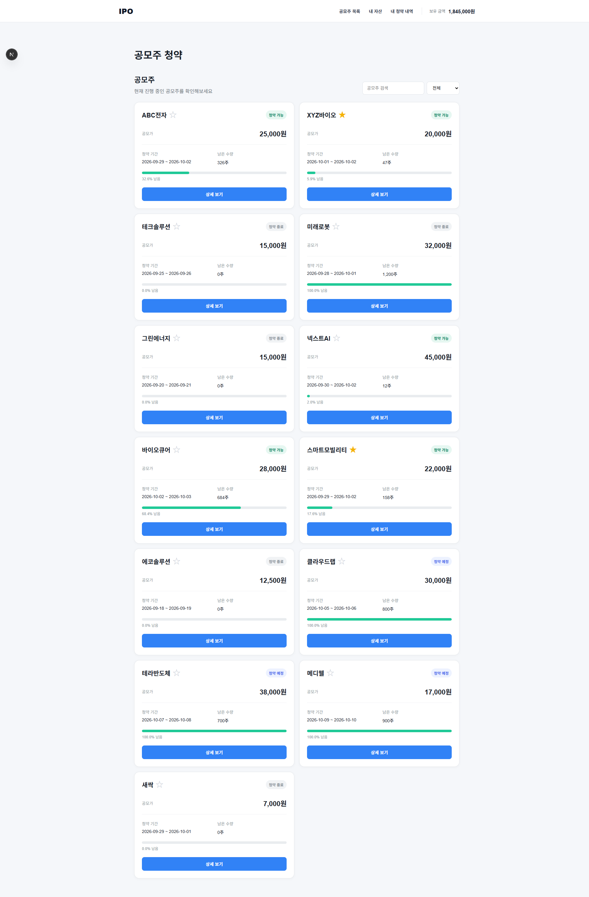
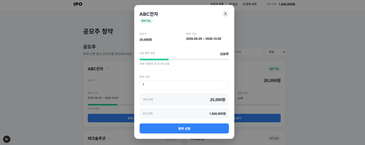
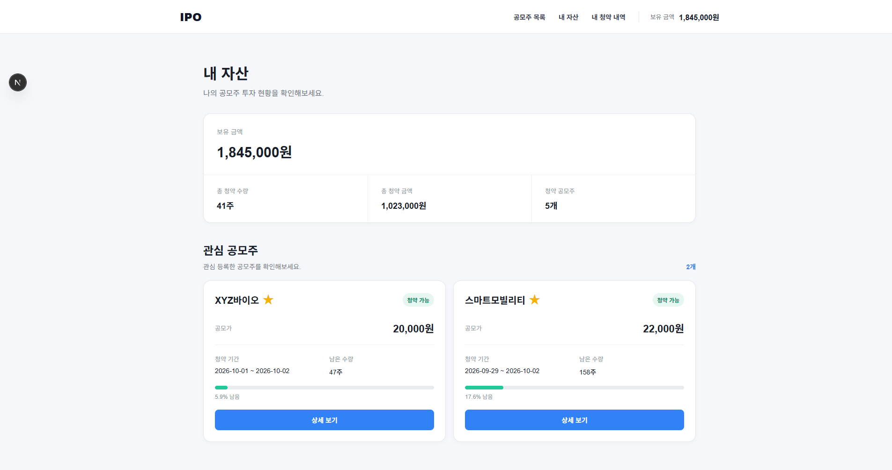
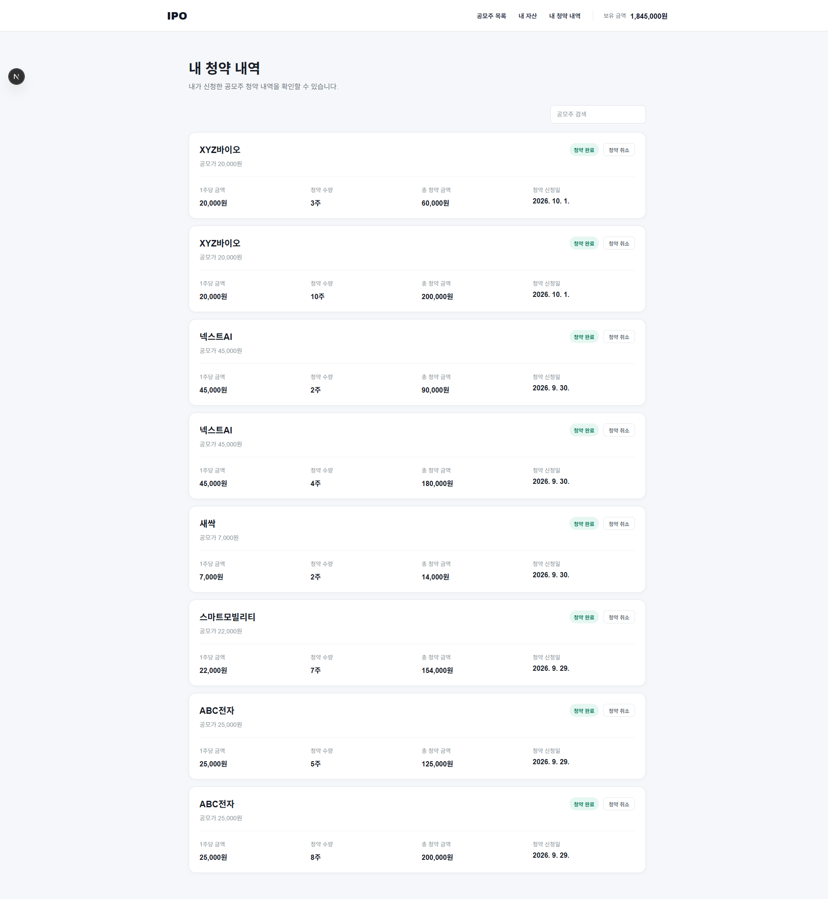

# IPO - 공모주 청약 서비스

## 1. 프로젝트 소개

### 프로젝트 이름

IPO

### 프로젝트 주제

공모주 정보를 확인하고 관심 종목을 관리하며, 실제 청약까지 진행할 수 있는 공모주 청약 서비스입니다.

### 제작 목적

공모주 투자 과정에서 사용자가 공모주 정보를 확인하고, 관심 종목을 관리하며, 청약 신청 및 청약 내역을 한 곳에서 확인할 수 있도록 서비스를 구현했습니다.

특히 React Query를 활용하여 서버 데이터를 관리하고, 공통 컴포넌트와 커스텀 훅을 활용하여 반복되는 기능을 재사용할 수 있도록 설계했습니다.

### 주요 사용자

공모주 청약에 관심이 있는 개인 투자자를 대상으로 합니다.

### 개발 기간

2026.09.28 ~ 2026.10.02

---

## 2. 주요 기능

| 기능 | 주소 | 설명 |
|---|---|---|
| 공모주 목록 조회 | `/` | 등록된 공모주 목록을 확인하고 검색 및 상태별 필터링을 할 수 있습니다. |
| 공모주 상세 조회 | `/` | 공모주 카드를 선택하면 상세 정보를 확인하고 청약을 신청할 수 있습니다. |
| 관심 공모주 등록/해제 | `/` | 별 버튼을 통해 관심 공모주를 등록하거나 해제할 수 있습니다. |
| 공모주 청약 | `/` | 청약 가능한 공모주의 수량을 입력하고 보유 금액을 확인한 후 청약할 수 있습니다. |
| 내 자산 조회 | `/my` | 보유 금액, 총 청약 수량, 총 청약 금액, 청약한 공모주 종류를 확인할 수 있는 자산 통계를 제공합니다. |
| 관심 공모주 조회 | `/my` | 관심 등록한 공모주를 한 곳에서 확인하고 상세 정보 및 청약을 진행할 수 있습니다. |
| 청약 내역 조회 | `/subscriptions/[userId]` | 사용자가 신청한 공모주 청약 내역을 확인하고 검색할 수 있습니다. |
| 청약 취소 | `/subscriptions/[userId]` | 신청한 청약을 취소하고 관련 자산 및 공모주 수량을 갱신할 수 있습니다. |

### 공모주 검색 및 필터링

공모주 이름을 검색하거나 청약 가능, 청약 예정, 청약 종료 상태를 기준으로 목록을 필터링할 수 있습니다.

### 관심 공모주

관심 있는 공모주를 별 버튼으로 등록할 수 있으며, 등록된 공모주는 내 자산 페이지의 관심 공모주 영역에서 확인할 수 있습니다.

### 공모주 청약

공모주의 상세 정보를 확인한 후 원하는 청약 수량을 입력할 수 있습니다.

청약 금액과 사용자의 보유 금액을 비교하여 잔액이 부족한 경우 청약을 진행할 수 없도록 처리했습니다.

### 자산 및 청약 내역 관리

청약이 완료되면 보유 금액과 공모주의 남은 청약 수량, 청약 내역이 갱신됩니다.

청약 내역에서 청약을 취소하면 관련 데이터도 다시 갱신되도록 구현했습니다.

---

## 3. 화면 구성

### 공모주 목록

공모주 목록에서 현재 등록된 공모주를 확인할 수 있습니다.

검색 기능과 상태 필터를 통해 원하는 공모주를 빠르게 찾을 수 있으며, 별 버튼을 통해 관심 공모주를 등록할 수 있습니다.



### 공모주 상세 및 청약

공모주를 선택하면 상세 정보를 모달로 확인할 수 있습니다.

청약 가능 여부와 남은 수량을 확인하고 청약 수량을 입력하여 청약할 수 있습니다.



### 내 자산

내 자산 페이지에서 사용자의 보유 금액과 청약 현황을 확인할 수 있습니다.

관심 등록한 공모주도 함께 확인할 수 있으며, 관심 공모주의 상세 정보를 확인하고 청약할 수 있습니다.



### 청약 내역

사용자가 신청한 공모주 청약 내역을 확인할 수 있습니다.

공모주 이름을 검색할 수 있으며, 청약 취소 기능을 제공합니다.



---

## 4. 기술 스택

### Frontend

- Next.js
- React
- JavaScript
- React Query
- CSS

### Data Management

- TanStack Query

### Development

- Git / GitHub
- VS Code


---

## 5. 설치 및 실행 방법

### 1. 프로젝트 클론

```bash
git clone [Repository URL]
cd [Project Name]
```

### 2. 패키지 설치
```bash
npm install
```

### 3. 개발 서버 실행
```bash
npm run dev
```

### 4. 브라우저 접속
```text
http://localhost:3000
```

## 6. 폴더 구조
```text
src/
├─ app/
│  ├─ page.js
│  ├─ my/
│  │  └─ page.js
│  └─ subscriptions/
│     └─ [userId]/
│        └─ page.js
│
├─ component/
│  ├─ Header.jsx
│  ├─ IpoCard.jsx
│  ├─ IpoList.jsx
│  └─ IpoModal.jsx
│
├─ hooks/
│  └─ useFavoriteIpo.js
│
├─ api/
│  ├─ ipo.js
│  ├─ user.js
│  └─ subscription.js
│
├─ utils/
│  └─ ipo.js
│
└─ store/
   └─ userStore.js

```

## 7. 컴포넌트 설계

### Header

모든 페이지에서 공통으로 사용하는 헤더입니다.

공모주 목록, 내 자산, 내 청약 내역으로 이동할 수 있으며 사용자의 보유 금액을 표시합니다.

### IpoList

공모주 목록을 조회하고 검색 및 상태 필터링을 담당합니다.

공모주를 선택하면 `IpoModal`을 열고, 관심 공모주 등록/해제 기능을 사용할 수 있습니다.

### IpoCard

하나의 공모주 정보를 카드 형태로 표시합니다.

공모주 이름, 공모가, 청약 기간, 남은 수량 및 관심 등록 상태를 표시합니다.

관심 등록/해제 기능은 외부에서 전달받은 `onFavoriteClick`을 통해 처리하여 카드 컴포넌트가 관심 등록 로직 자체를 직접 관리하지 않도록 구성했습니다.

### IpoModal

선택한 공모주의 상세 정보를 보여주고 청약 수량을 입력받아 청약을 처리합니다.

청약 가능 여부와 남은 수량을 확인하고, 입력한 청약 금액과 사용자의 보유 금액을 비교하여 잔액이 부족한 경우 청약할 수 없도록 처리했습니다.

청약이 완료되면 React Query의 관련 Query를 갱신하여 사용자 잔액, 청약 내역, 공모주 남은 수량이 최신 데이터로 반영되도록 했습니다.

### useFavoriteIpo

관심 공모주 등록/해제 로직을 커스텀 훅으로 분리했습니다.

공모주 목록과 관심 공모주 목록에서 동일한 관심 토글 기능을 사용할 수 있도록 하여 관심 등록 로직의 중복을 줄였습니다.

### 상태 관리

서버에서 가져오는 사용자 정보, 공모주 목록, 청약 내역 등의 데이터는 React Query를 사용하여 관리했습니다.

청약 신청, 청약 취소, 관심 공모주 등록/해제와 같이 서버 데이터가 변경되는 경우 관련 Query를 갱신하여 화면에 최신 데이터가 반영되도록 처리했습니다.

초기에는 사용자 정보를 Zustand로 관리했지만, 서버에서 관리되는 사용자 정보와 Zustand의 사용자 정보가 중복되는 문제가 발생했습니다.

이를 정리하면서 서버에서 관리되는 데이터는 React Query를 사용하고, 별도의 클라이언트 전역 상태가 필요한 경우에만 Zustand를 사용하는 방향으로 구조를 개선했습니다.


## 8. 트러블슈팅

### React Query와 Zustand에 동일한 사용자 정보가 존재하는 문제

#### 문제

초기에는 사용자 정보를 Zustand에서 관리하고 있었습니다.

이후 React Query를 사용하여 서버에서 사용자 정보를 가져오면서 일부 컴포넌트에서는 Zustand의 `user`를 사용하고, 다른 컴포넌트에서는 React Query의 `currentUser`를 사용하는 상황이 발생했습니다.

이로 인해 동일한 사용자 정보가 서로 다른 곳에서 관리되었고, 사용자 정보가 변경되었을 때 어떤 데이터를 기준으로 사용해야 하는지 혼란이 발생했습니다.

#### 원인

Zustand와 React Query의 역할을 명확하게 구분하지 않고 동일한 사용자 데이터를 두 곳에서 관리했기 때문입니다.

Zustand는 클라이언트 전역 상태를 관리하기 위한 도구이고, React Query는 서버에서 가져온 데이터를 캐싱하고 동기화하기 위한 도구인데 두 상태 관리 도구에 동일한 사용자 정보를 저장하고 있었습니다.

#### 해결

사용자 정보와 같이 서버에서 조회하고 변경되는 데이터는 React Query를 통해 관리하도록 구조를 변경했습니다.

사용자 정보는 다음과 같이 Query를 통해 조회하도록 통일했습니다.

```javascript
const {
  data: currentUser,
  isLoading,
  isError,
} = useQuery({
  queryKey: ["user", userId],
  queryFn: () => userApi.getUser(userId),
});
```

또한 청약 신청이나 관심 공모주 변경 등 사용자 정보가 변경되는 작업 이후에는 관련 Query를 갱신하여 최신 서버 데이터를 다시 가져오도록 처리했습니다.

```js
await queryClient.invalidateQueries({
  queryKey: ["user", userId],
});
```

### 알게 된 점
서버에서 관리되는 데이터를 전역 상태에 별도로 저장하면 데이터가 중복되고 동기화해야 할 대상이 늘어날 수 있다는 것을 알게 되었습니다.

React Query와 Zustand는 모두 상태를 관리할 수 있지만 목적이 다르다는 것을 이해하게 되었고, 서버 상태와 클라이언트 상태를 구분하여 적절한 도구를 선택하는 것이 중요하다는 것을 배웠습니다.

# 9. 프로젝트 회고
직접 공모주 청약 서비스를 기획하고 구현하면서 단순히 기능을 구현하는 것뿐만 아니라 여러 페이지에서 반복되는 기능을 어떻게 재사용할지 고민하게 되었습니다.

특히 공모주 관심 등록 기능을 커스텀 훅으로 분리하고, 공통 Header와 컴포넌트를 구성하면서 재사용 가능한 구조를 만드는 것의 중요성을 알게 되었습니다.

또한 React Query를 사용하면서 서버 상태와 클라이언트 상태의 차이를 이해하게 되었고, 데이터 변경 후 관련 Query를 갱신하여 최신 데이터를 화면에 반영하는 방법을 경험할 수 있었습니다.

추후에는 실제 로그인 기능을 추가하여 현재 임시로 사용하고 있는 사용자 ID를 실제 로그인 사용자 기준으로 변경하고, 공모주 상세 페이지와 더 다양한 자산 통계 기능을 추가해보고 싶습니다.


